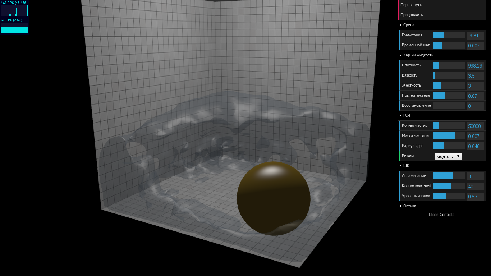
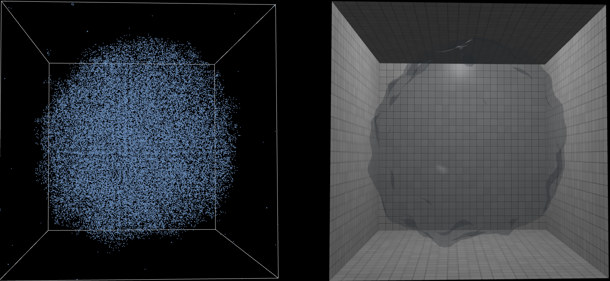

# WebGL SPH + MC simulation

1. [Demo](http://loyd.github.io/sph-mc). Turn on checkbox `Real-time` to force real-time simulation (GPU expensive!).
2. [Report (ru)](docs/ru/report/index.pdf).
3. [Slides (ru)](docs/ru/slides/index.pdf).

Many thanks to **Hector Arellano** for his timely advice.

User interface (language depends on locale):

Weightlessness:

## License
The source code is licensed under [MIT license](http://opensource.org/licenses/mit-license.php).

The report and slides are not licensed (no rights are given to reproduce or modify this work).
